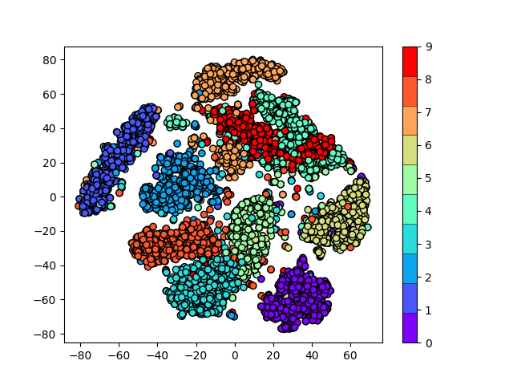
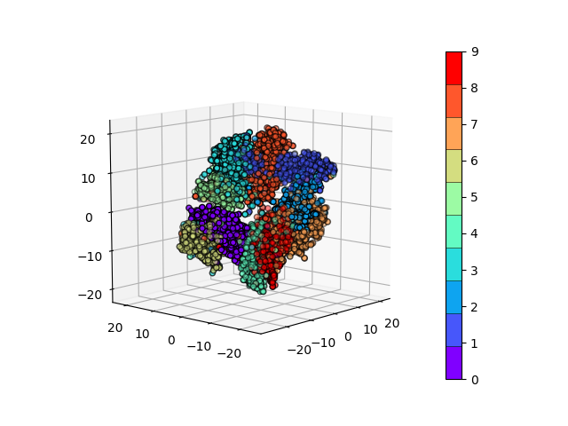
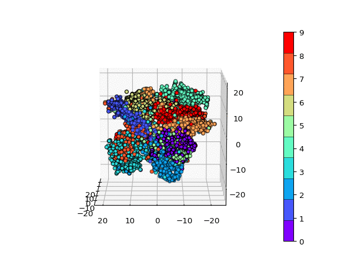

# Visualization of (relatively) clear clustering of MNIST dataset- autoencoder + t-SNE dim-reduction

Inspired by [this paper](https://arxiv.org/pdf/1802.00187.pdf), This script trains an autoencoder to compress the MNIST dataset into a relatively small dimension (30 for the below images), then applies t-SNE dimensionality reduction to compress the dataset further into 2 or 3 dimensions which are visualized below.

Below is the resulting visualization of the MNIST dataset visualized in two dimensions:

and in three dimensions:

It may be hard to see the clustering in a static image, so here is an animated version of the above plot.

These results are generally poorer than the results the linked paper contains. This was relatively quick so the autoencoder structure should be varied in terms of layer size, regularization, dropout, etc. to find a better result (todo).

